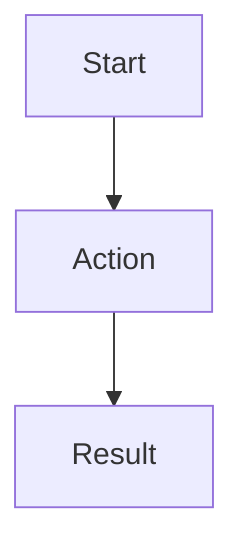

# Features Documentation

Detailed specifications for all Predict3 features.

## Active Features

### Authentication & User Management
- User registration and login
- Password reset via email
- Session persistence across platforms
- Role-based access control (Player, Group Admin, Super Admin)
- Cross-tab session synchronization

### Player Features
- Player dashboard
- Prediction submission
- Standings and leaderboards
- Group participation

### Group Admin Features
- Group creation and management
- Member invitations
- Group settings configuration
- Group analytics

### Super Admin Features
- System overview dashboard
- User management
- System metrics and monitoring

## Feature Documentation Template

When documenting a new feature, use this template:

```markdown
# Feature: [Name]

**Status:** [Planned | In Development | Testing | Released | Deprecated]
**Version:** [When released]
**Author:** [Name]
**Date:** [YYYY-MM-DD]

## Overview
[Brief description of the feature and its purpose]

## User Stories

### As a [role]
- I want to [action]
- So that [benefit]

**Acceptance Criteria:**
- [ ] Criterion 1
- [ ] Criterion 2

## Technical Specification

### Components
- `ComponentName` - Description
- Location: `path/to/component`

### Services
- `ServiceName` - Description
- Location: `path/to/service`

### Database Changes
- Tables: [list tables]
- Migrations: [link to migration file]

### API Endpoints
- `GET /endpoint` - Description
- `POST /endpoint` - Description

## User Flow



## UI/UX Design
[Link to designs or screenshots]

## Testing
- [ ] Unit tests
- [ ] Integration tests
- [ ] E2E tests
- [ ] Manual testing checklist

## Security Considerations
- Auth requirements
- Data validation
- RLS policies

## Performance Considerations
- Expected load
- Caching strategy
- Optimization opportunities

## Deployment
- Feature flags: [yes/no]
- Rollout strategy: [gradual/full]
- Monitoring: [metrics to track]

## References
- [Related docs]
- [External resources]

---
_Last Updated: [YYYY-MM-DD]_
```

## Feature Status

### Released
- Authentication system
- User profiles
- Role-based access control

### In Development
- [List features currently being built]

### Planned
- Push notifications
- Social sharing
- Achievement system
- Multi-language support

### Deprecated
- [List deprecated features]

---

_Last Updated: 2026-01-03_
