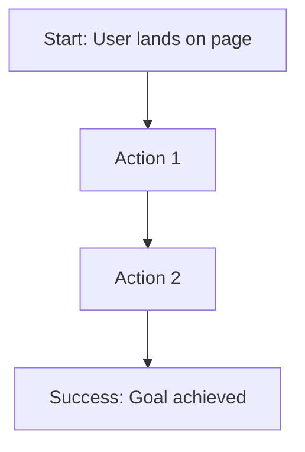

# UX Documentation

User experience research, flows, wireframes, and usability testing.

## Contents

### User Flows
- Authentication flows
- Feature-specific user journeys
- Error and edge case flows

### Wireframes
- Low-fidelity wireframes
- High-fidelity mockups
- Interactive prototypes

### Usability Testing
- Test plans
- Test results
- User feedback

### Accessibility
- WCAG compliance
- Screen reader testing
- Keyboard navigation

## User Flow Template

```markdown
# User Flow: [Feature Name]

**Created:** [YYYY-MM-DD]
**Status:** [Draft | Approved | Implemented]

## Goal
[What is the user trying to accomplish?]

## Entry Points
- Entry point 1
- Entry point 2

## Happy Path



## Alternative Paths

### Error Path 1: [Name]
[Description and flow]

### Edge Case: [Name]
[Description and flow]

## Exit Points
- Success: [Where user ends up]
- Failure: [Error states]

## UI Elements Required
- [ ] Component 1
- [ ] Component 2

## Validation Rules
- Rule 1
- Rule 2

## Error Messages
- Error 1: "Message text"
- Error 2: "Message text"

---
_Last Updated: [YYYY-MM-DD]_
```

## Key User Flows

### Authentication
- Login flow
- Signup flow
- Password reset flow
- First-time user onboarding

### Core Features
- Make a prediction
- View leaderboard
- Join a group
- Create a group (admin)

## Usability Principles

1. **Simplicity:** Keep interfaces clean and focused
2. **Consistency:** Use patterns consistently across the app
3. **Feedback:** Provide clear feedback for all actions
4. **Error Prevention:** Validate inputs and guide users
5. **Accessibility:** Support all users including those with disabilities

## Accessibility Guidelines

### WCAG 2.1 Level AA Compliance
- [ ] Text has sufficient color contrast (4.5:1 minimum)
- [ ] All interactive elements keyboard accessible
- [ ] Form inputs have proper labels
- [ ] Images have alt text
- [ ] Semantic HTML used throughout
- [ ] Screen reader tested

### Testing Tools
- axe DevTools
- WAVE
- Lighthouse accessibility audit

---

_Last Updated: 2026-01-03_
